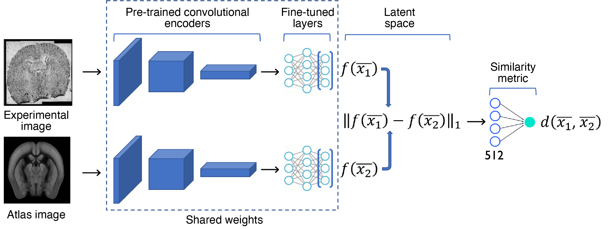

# Siamese Neural Network for anatomical registration

In this repository is contained the code of the paper <https://www.biorxiv.org/content/10.1101/2020.08.29.272831v1> relative to the registration pipeline. The aim of this model is, given an histology image of a coronal slice of the mouse brain, to identify its "depth" into the brain by comparing it 
with an existing atlas (e.g. Allen CCF).
The model is a Siamese Neural Network based on a pretrained DenseNet encoder of which we fine-tuned the final layers. The model works as depicted in the figure below.



In this repository you can find:
- The code used to train the model
- A pretrained version of the model itself 
- A jupyter notebook containing some usage examples

To run the code you need ```Python >= 3.6``` and the following packages installed:
```
tensorflow > 2.0
numpy
matplotlib
imgaug
pandas
pickle
umap-learn
scipy
```
You will also need to populate the ```brain_images``` folder with the mouse brain samples that can be found at: LINK  
To train a new model edit the file ```main.py``` with the correct hyperparameters and run the command ```python main.py```.  
To test a trained model use the notebook ```Predictions.ipynb```.  
